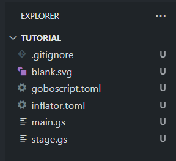
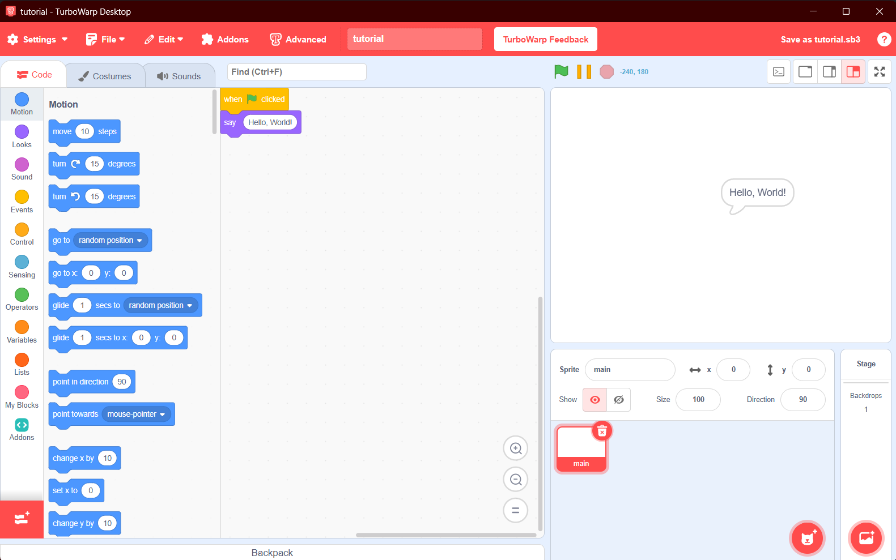

# Getting started

> This section covers making a project and installing dependencies with inflator

!!! Warning

    Before doing anything here, install [goboscript](https://aspizu.github.io/goboscript/), as it is
    required for the rest of this tutorial.

    It is also recommended to use VSCode with the goboscript editor integration as an IDE of choice.

Let's make a new project with inflator. We'll call it `tutorial`.

Run `inflate new tutorial`. This makes a new project in the directory `tutorial`.
Now open that folder in your IDE.

Here is what mine looks like:

??? Question "What's the difference between this and [goboscript new?](https://aspizu.github.io/goboscript/getting-started/#create-a-new-project)"

    1. Inflator also adds an `inflator.toml` file
    2. There is not as much customisation, e.g. disabling the automatic initialisation of a git repository

    ??? Question "How can I use the behaviour from goboscript new?"
        
        1. Make a project with `goboscript new <args>`
        2. Run `inflate toml` within that directory. This will create the inflator.toml file.

Now that we have a goboscript project, check that you can run it using `goboscript build`.
This will generate a sb3 file that you can run in TurboWarp.

If you have TurboWarp bound to the `.sb3` file type, run `start tutorial.sb3` (windows) or `xdg-open tutorial.sb3` (linux).

You should get a 'Hello World' program like this:

